# �� T4M Billing System - Firebase Edition

**Complete billing and commission management system for trend4media GmbH**

## ✅ Migration Complete - No More Docker Errors!

**Previous issues SOLVED:**
- ❌ ~~Docker build failures~~
- ❌ ~~Nixpacks configuration errors~~ 
- ❌ ~~Railway deployment issues~~
- ❌ ~~PostgreSQL setup complexity~~

**Now powered by Firebase:**
- ✅ **One-command deployment**: `./deploy-firebase.sh`
- ✅ **Serverless backend**: Firebase Cloud Functions
- ✅ **Managed database**: Firestore
- ✅ **Built-in authentication**: Firebase Auth
- ✅ **Global CDN hosting**: Firebase Hosting

---

## 🏃‍♂️ Quick Start (5 Minutes)

```bash
# 1. Install dependencies
npm run setup

# 2. Login to Firebase
firebase login

# 3. Deploy everything!
./deploy-firebase.sh
```

**That's it! No Docker, no PostgreSQL setup, no complex configurations.**

---

## 📋 New Architecture

```
🔥 Firebase Backend (Cloud Functions)
├── Authentication & Authorization
├── Manager & Creator Management  
├── Transaction Processing
├── Excel Upload & Processing
├── Bonus Calculations
├── Real-time Analytics

🌐 Next.js Frontend (Firebase Hosting)
├── Manager Dashboard
├── Admin Panel
├── Real-time Charts
├── File Upload Interface

📊 Firestore Database
├── Users & Roles
├── Transactions
├── Managers & Creators
├── Audit Logs
```

---

## 🛠️ Development

### Local Development
```bash
# Start Firebase Emulators (Backend + Frontend + Database)
npm run dev

# Frontend only (in trend4media-frontend/)
cd trend4media-frontend && npm run dev
```

### Deployment
```bash
# Deploy everything
npm run deploy

# Deploy only backend
npm run deploy:functions

# Deploy only frontend  
npm run deploy:hosting
```

---

## 🔧 Configuration

See **[FIREBASE_SETUP.md](./FIREBASE_SETUP.md)** for detailed setup instructions.

**Environment Variables** (`trend4media-frontend/.env.local`):
```env
FIREBASE_PROJECT_ID=your-project-id
FIREBASE_API_KEY=your-api-key
NEXT_PUBLIC_API_URL=https://europe-west1-your-project.cloudfunctions.net/api
```

---

## 📊 Features

### 💼 Manager Dashboard
- **Live Managers**: Real-time streaming performance & earnings
- **Team Management**: Creator teams & commission tracking
- **Earnings Overview**: Live commission calculations
- **Genealogy Tree**: Visual manager hierarchies

### 👨‍💼 Admin Panel
- **Excel Upload**: Batch transaction processing
- **User Management**: Manager and creator administration
- **Commission Rates**: Configurable payout structures
- **Reports & Analytics**: Comprehensive financial reporting

### 🔐 Security
- **Firebase Authentication**: Built-in secure auth
- **Firestore Rules**: Database-level security
- **Role-based Access**: Admin/Manager permissions
- **Audit Logging**: Complete action tracking

---

## 🚀 Deployment Status

| Service | Platform | Status | URL |
|---------|----------|---------|-----|
| **Frontend** | Firebase Hosting | ✅ Live | `https://your-project.web.app` |
| **Backend API** | Cloud Functions | ✅ Live | `https://europe-west1-your-project.cloudfunctions.net/api` |
| **Database** | Firestore | ✅ Live | Managed by Firebase |
| **Auth** | Firebase Auth | ✅ Live | Integrated |

---

## 📈 Benefits of Firebase Migration

| Before (Docker/Railway) | After (Firebase) |
|------------------------|------------------|
| ❌ Complex build process | ✅ Simple deployment |
| ❌ Docker errors | ✅ Serverless functions |
| ❌ Database setup | ✅ Managed Firestore |
| ❌ Manual scaling | ✅ Auto-scaling |
| ❌ Multiple services | ✅ Unified platform |
| ❌ DevOps complexity | ✅ One-click deploy |

---

## 📞 Support & Troubleshooting

### Common Commands
```bash
# View function logs
firebase functions:log

# Test locally
firebase emulators:start

# Deploy specific parts
firebase deploy --only functions
firebase deploy --only hosting
```

### Getting Help
1. Check **[FIREBASE_SETUP.md](./FIREBASE_SETUP.md)** for detailed guides
2. Use Firebase Console for monitoring
3. Check browser dev tools for frontend issues
4. Use `firebase emulators:start` for local testing

---

## 🎯 Next Steps

1. **Create Firebase Project**: `firebase projects:create your-project-name`
2. **Configure Environment**: Copy `.env.local` template
3. **Deploy**: Run `./deploy-firebase.sh`
4. **Go Live**: Share your `https://your-project.web.app` URL

---

## 💎 Dual-Period Upload & Diamond Bonus

### Overview

The system supports a two-phase upload process that enables Diamond bonus calculations based on previous month performance comparison.

### How It Works

```mermaid
graph TD
    A[Upload Previous Month as Comparison] --> B[System Saves Net Amounts]
    B --> C[Upload Current Month]
    C --> D[System Calculates Bonuses]
    D --> E{Net >= 1.2 × Previous Net?}
    E -->|Yes| F[Award Diamond Bonus 50€/60€]
    E -->|No| G[No Diamond Bonus]
```



### API Usage

#### 1. Upload Comparison Month (Previous Month Data)

```bash
POST /uploads/excel?comparison=true
Content-Type: multipart/form-data

# File: june-2025.xlsx (previous month)
```

**Response:**
```json
{
  "message": "Excel file processed successfully",
  "summary": {
    "processedRows": 150,
    "comparisonMode": true,
    "savedNetAmounts": 45
  }
}
```

#### 2. Upload Current Month (Full Processing)

```bash
POST /uploads/excel
Content-Type: multipart/form-data

# File: july-2025.xlsx (current month)
```

**Response includes Diamond bonus calculations:**
```json
{
  "managerHandle": "john-doe",
  "month": "202507",
  "gross": 2000.00,
  "net": 1200.00,
  "baseCommission": 360.00,
  "graduationBonus": 50.00,
  "diamondBonus": 50.00,
  "totalEarnings": 1010.00
}
```

### Diamond Bonus Rules

| Manager Type | Bonus Amount | Trigger Condition |
|--------------|--------------|-------------------|
| Live Manager | €50.00       | Current net ≥ 1.2 × Previous net |
| Team Manager | €60.00       | Current net ≥ 1.2 × Previous net |

### Admin View - Comparison Uploads

```bash
GET /uploads/comparison-uploads
```

**Response:**
```json
[
  {
    "period": "202506",
    "managerCount": 45,
    "firstUpload": "2025-06-01T10:00:00Z",
    "lastUpload": "2025-06-01T10:00:00Z",
    "fileName": "comparison-202506.xlsx"
  }
]
```

### Frontend Integration

#### Manager Dashboard
- **Diamond Goal Badge**: Prominently displays when Diamond bonus is achieved
- **Achievement Notification**: "🎉 Diamond Goal Achieved!"
- **Bonus Amount**: Highlighted in earnings summary

#### Admin Panel
- **Comparison Uploads View**: Lists all uploaded comparison months
- **Upload History**: Shows which periods have baseline data
- **Manager Performance Tracking**: Diamond bonus achievement rates

### Database Schema

#### ManagerMonthlyNet Table
```sql
CREATE TABLE manager_monthly_net (
  managerId VARCHAR PRIMARY KEY,
  period VARCHAR PRIMARY KEY,        -- 'YYYYMM'
  netCent BIGINT NOT NULL,          -- Net amount in cents
  uploadedAt TIMESTAMP DEFAULT NOW()
);
```

### Implementation Details

1. **Comparison Mode**: When `?comparison=true` is passed, system:
   - Processes Excel normally
   - Calculates net amounts per manager
   - Saves to `ManagerMonthlyNet` table
   - **Skips** bonus calculations and commission processing

2. **Regular Mode**: When processing current month:
   - Processes Excel with full calculations
   - Retrieves previous month net from `ManagerMonthlyNet`
   - Calculates Diamond bonus: `net >= Math.round(previousNet * 1.2)`
   - Awards role-specific bonus amounts

3. **Fallback Logic**: If no previous month data exists:
   - No Diamond bonus awarded
   - System continues normal processing
   - Logs warning for audit trail

### Testing

```bash
# Test Diamond bonus logic
npm test -- --testNamePattern="Diamond Bonus Tests"

# Test upload endpoints
npm run test:e2e -- upload-to-payout-workflow.spec.ts
```

---

**Welcome to serverless development! 🔥** 